# RBAC database schema, diagram, and implement the Laravel components (migrations, models, and seeders).

This Role-Based Access Control (RBAC) implementation for Laravel, including database schema, migrations, models, seeders, and middleware.

## Database Structure

The RBAC system consists of these core tables:

1. **users** - Standard Laravel users table
2. **roles** - Defines available roles in the system
3. **permissions** - Specific actions that can be performed
4. **resources** - System resources that permissions apply to

And these junction tables for relationships:

1. **user_roles** - Maps users to their assigned roles
2. **role_permissions** - Maps roles to their granted permissions
3. **permission_resources** - Maps permissions to specific resources

```mermaid
    erDiagram
        USERS ||--o{ USER_ROLES : "assigned to"

        USER_ROLES }o--|| ROLES : "has"
        ROLES ||--o{ ROLE_PERMISSIONS : "contains"
        ROLE_PERMISSIONS }o--|| PERMISSIONS : "grants"
        PERMISSIONS ||--o{ PERMISSION_RESOURCES : "applies to"
        PERMISSION_RESOURCES }o--|| RESOURCES : "controlled by"

        USERS {
            bigIncrements id PK
            string name
            string email UK
            timestamp email_verified_at
            string password
            string remember_token
            timestamps timestamps
        }

        ROLES {
            bigIncrements id PK
            string name UK
            string display_name
            string description
            timestamps timestamps
        }

        PERMISSIONS {
            bigIncrements id PK
            string name UK
            string display_name
            string description
            timestamps timestamps
        }

        RESOURCES {
            bigIncrements id PK
            string name UK
            string resource_type
            string description
            timestamps timestamps
        }

        USER_ROLES {
            bigIncrements id PK
            unsignedBigInteger user_id FK
            unsignedBigInteger role_id FK
            timestamps timestamps
        }

        ROLE_PERMISSIONS {
            bigIncrements id PK
            unsignedBigInteger role_id FK
            unsignedBigInteger permission_id FK
            timestamps timestamps
        }

        PERMISSION_RESOURCES {
            bigIncrements id PK
            unsignedBigInteger permission_id FK
            unsignedBigInteger resource_id FK
            timestamps timestamps
        }
```



---

## Laravel Components

```bash
php artisan make:model Role -a
php artisan make:model Permission -a
php artisan make:model Resource -a

php artisan make:migration create_user_roles_table
php artisan make:migration create_role_permissions_table
php artisan make:migration create_permission_resources_table
```

### Migrations

#### Role Table Migration

`database/migrations/xxxx_xx_xx_xxxxxx_create_roles_table.php`

```php
<?php

use Illuminate\Database\Migrations\Migration;
use Illuminate\Database\Schema\Blueprint;
use Illuminate\Support\Facades\Schema;

class CreateRolesTable extends Migration
{
    public function up()
    {
        Schema::create('roles', function (Blueprint $table) {
            $table->bigIncrements('id');
            $table->string('name')->unique();
            $table->string('display_name')->nullable();
            $table->string('description')->nullable();
            $table->timestamps();
        });
    }

    public function down()
    {
        Schema::dropIfExists('roles');
    }
}
```

#### Permissions Table Migration

`database/migrations/xxxx_xx_xx_xxxxxx_create_permissions_table.php`

```php
<?php

use Illuminate\Database\Migrations\Migration;
use Illuminate\Database\Schema\Blueprint;
use Illuminate\Support\Facades\Schema;

class CreatePermissionsTable extends Migration
{
    public function up()
    {
        Schema::create('permissions', function (Blueprint $table) {
            $table->bigIncrements('id');
            $table->string('name')->unique();
            $table->string('display_name')->nullable();
            $table->string('description')->nullable();
            $table->timestamps();
        });
    }

    public function down()
    {
        Schema::dropIfExists('permissions');
    }
}

```

#### Resource Table Migration

`database/migrations/xxxx_xx_xx_xxxxxx_create_resources_table.php`

```php
<?php

use Illuminate\Database\Migrations\Migration;
use Illuminate\Database\Schema\Blueprint;
use Illuminate\Support\Facades\Schema;

class CreateResourcesTable extends Migration
{
    public function up()
    {
        Schema::create('resources', function (Blueprint $table) {
            $table->bigIncrements('id');
            $table->string('name')->unique();
            $table->string('resource_type');
            $table->string('description')->nullable();
            $table->timestamps();
        });
    }

    public function down()
    {
        Schema::dropIfExists('resources');
    }
}
```

#### User Roles Table Migration

`database/migrations/xxxx_xx_xx_xxxxxx_create_user_roles_table.php`

```php
<?php

use Illuminate\Database\Migrations\Migration;
use Illuminate\Database\Schema\Blueprint;
use Illuminate\Support\Facades\Schema;

class CreateUserRolesTable extends Migration
{
    public function up()
    {
        Schema::create('user_roles', function (Blueprint $table) {
            $table->bigIncrements('id');
            $table->unsignedBigInteger('user_id');
            $table->unsignedBigInteger('role_id');
            $table->timestamps();

            $table->foreign('user_id')
                ->references('id')
                ->on('users')
                ->onDelete('cascade');

            $table->foreign('role_id')
                ->references('id')
                ->on('roles')
                ->onDelete('cascade');

            $table->unique(['user_id', 'role_id']);
        });
    }

    public function down()
    {
        Schema::dropIfExists('user_roles');
    }
}
```

#### Role Permissions Table Migration

`database/migrations/xxxx_xx_xx_xxxxxx_create_role_permissions_table.php`

```php
<?php

use Illuminate\Database\Migrations\Migration;
use Illuminate\Database\Schema\Blueprint;
use Illuminate\Support\Facades\Schema;

class CreateRolePermissionsTable extends Migration
{
    public function up()
    {
        Schema::create('role_permissions', function (Blueprint $table) {
            $table->bigIncrements('id');
            $table->unsignedBigInteger('role_id');
            $table->unsignedBigInteger('permission_id');
            $table->timestamps();

            $table->foreign('role_id')
                ->references('id')
                ->on('roles')
                ->onDelete('cascade');

            $table->foreign('permission_id')
                ->references('id')
                ->on('permissions')
                ->onDelete('cascade');

            $table->unique(['role_id', 'permission_id']);
        });
    }

    public function down()
    {
        Schema::dropIfExists('role_permissions');
    }
}
```

#### Permission Resources Table Migration

`database/migrations/xxxx_xx_xx_xxxxxx_create_permission_resources_table.php`

```php
<?php

use Illuminate\Database\Migrations\Migration;
use Illuminate\Database\Schema\Blueprint;
use Illuminate\Support\Facades\Schema;

class CreatePermissionResourcesTable extends Migration
{
    public function up()
    {
        Schema::create('permission_resources', function (Blueprint $table) {
            $table->bigIncrements('id');
            $table->unsignedBigInteger('permission_id');
            $table->unsignedBigInteger('resource_id');
            $table->timestamps();

            $table->foreign('permission_id')
                ->references('id')
                ->on('permissions')
                ->onDelete('cascade');

            $table->foreign('resource_id')
                ->references('id')
                ->on('resources')
                ->onDelete('cascade');

            $table->unique(['permission_id', 'resource_id']);
        });
    }

    public function down()
    {
        Schema::dropIfExists('permission_resources');
    }
}
```

### Models

#### User Model

`app/Models/User.php`

_(extended from Laravel's default user model)_

```php
<?php

namespace App\Models;

use Illuminate\Database\Eloquent\Factories\HasFactory;
use Illuminate\Foundation\Auth\User as Authenticatable;
use Illuminate\Notifications\Notifiable;
use Laravel\Sanctum\HasApiTokens;

class User extends Authenticatable
{
    use HasApiTokens, HasFactory, Notifiable;

    /**
     * The attributes that are mass assignable.
     *
     * @var array<int, string>
     */
    protected $fillable = [
        'name',
        'email',
        'password',
    ];

    /**
     * The attributes that should be hidden for serialization.
     *
     * @var array<int, string>
     */
    protected $hidden = [
        'password',
        'remember_token',
    ];

    /**
     * The attributes that should be cast.
     *
     * @var array<string, string>
     */
    protected $casts = [
        'email_verified_at' => 'datetime',
        'password' => 'hashed',
    ];

    /**
     * Get the roles for the user.
     */
    public function roles()
    {
        return $this->belongsToMany(Role::class, 'user_roles');
    }

    /**
     * Check if the user has a specific role.
     */
    public function hasRole($roleName)
    {
        return $this->roles()->where('name', $roleName)->exists();
    }

    /**
     * Check if the user has a permission through any of their roles.
     */
    public function hasPermission($permissionName)
    {
        foreach ($this->roles as $role) {
            if ($role->permissions()->where('name', $permissionName)->exists()) {
                return true;
            }
        }

        return false;
    }

    /**
     * Check if the user has access to a specific resource.
     */
    public function hasResourceAccess($resourceName, $permissionName)
    {
        foreach ($this->roles as $role) {
            foreach ($role->permissions as $permission) {
                if ($permission->name === $permissionName) {
                    if ($permission->resources()->where('name', $resourceName)->exists()) {
                        return true;
                    }
                }
            }
        }

        return false;
    }
}
```

#### Role Model

`app/Models/Role.php`

```php
<?php

namespace App\Models;

use Illuminate\Database\Eloquent\Factories\HasFactory;
use Illuminate\Database\Eloquent\Model;

class Role extends Model
{
    use HasFactory;

    /**
     * The attributes that are mass assignable.
     *
     * @var array<int, string>
     */
    protected $fillable = [
        'name',
        'display_name',
        'description',
    ];

    /**
     * Get the users that have this role.
     */
    public function users()
    {
        return $this->belongsToMany(User::class, 'user_roles');
    }

    /**
     * Get the permissions for this role.
     */
    public function permissions()
    {
        return $this->belongsToMany(Permission::class, 'role_permissions');
    }

    /**
     * Assign a permission to the role.
     */
    public function givePermissionTo($permission)
    {
        if (is_string($permission)) {
            $permission = Permission::whereName($permission)->firstOrFail();
        }

        $this->permissions()->syncWithoutDetaching([$permission->id]);
    }
}
```

#### Permission Model

`app/Models/Permission.php`

```php
<?php

namespace App\Models;

use Illuminate\Database\Eloquent\Factories\HasFactory;
use Illuminate\Database\Eloquent\Model;

class Permission extends Model
{
    use HasFactory;

    /**
     * The attributes that are mass assignable.
     *
     * @var array<int, string>
     */
    protected $fillable = [
        'name',
        'display_name',
        'description',
    ];

    /**
     * Get the roles that have this permission.
     */
    public function roles()
    {
        return $this->belongsToMany(Role::class, 'role_permissions');
    }

    /**
     * Get the resources this permission applies to.
     */
    public function resources()
    {
        return $this->belongsToMany(Resource::class, 'permission_resources');
    }

    /**
     * Assign this permission to a resource.
     */
    public function assignToResource($resource)
    {
        if (is_string($resource)) {
            $resource = Resource::whereName($resource)->firstOrFail();
        }

        $this->resources()->syncWithoutDetaching([$resource->id]);
    }
}
```

#### Resource Model

`app/Models/Resource.php`

```php
<?php

namespace App\Models;

use Illuminate\Database\Eloquent\Factories\HasFactory;
use Illuminate\Database\Eloquent\Model;

class Resource extends Model
{
    use HasFactory;

    /**
     * The attributes that are mass assignable.
     *
     * @var array<int, string>
     */
    protected $fillable = [
        'name',
        'resource_type',
        'description',
    ];

    /**
     * Get the permissions for this resource.
     */
    public function permissions()
    {
        return $this->belongsToMany(Permission::class, 'permission_resources');
    }
}
```

### Seeders

#### User Seeder

| Name         | Email               | Password |
| ------------ | ------------------- | -------- |
| Admin User   | admin@example.com   | password |
| Manager User | manager@example.com | password |
| Regular User | user@example.com    | password |

1. Create UserSeeder:

    ```bash
    php artisan make:seeder UserSeeder
    ```

2. Update UserSeeder (`database/seeders/UserSeeder.php`)

    ```php
    <?php

    namespace Database\Seeders;

    use App\Models\User;
    use Illuminate\Database\Console\Seeds\WithoutModelEvents;
    use Illuminate\Database\Seeder;
    use Illuminate\Support\Facades\Hash;

    class UserSeeder extends Seeder
    {
        /**
         * Run the database seeds.
         */
        public function run(): void
        {
            $users = [
                [
                    'name' => 'Admin User',
                    'email' => 'admin@example.com',
                    'password' => Hash::make('password'),
                ],
                [
                    'name' => 'Manager User',
                    'email' => 'manager@example.com',
                    'password' => Hash::make('password'),
                ],
                [
                    'name' => 'Regular User',
                    'email' => 'user@example.com',
                    'password' => Hash::make('password'),
                ]
            ];

            foreach ($users as $user) {
                User::create($user);
            }
        }
    }
    ```

3. Register seeder inside `database/seeders/DatabaseSeeder.php`:

    ```php
    public function run()
    {
        $this->call([
            // ...
            UserSeeder::class
        ]);
    }
    ```

4. Run Seeder

    An individual seeder:

    ```bash
    php artisan db:seed --class=UserSeeder
    ```

    Or re-run migrations with seeders:

    ```bash
    php artisan migrate:fresh --seed
    ```

#### Role Seeder

| Name    | Display Name  | Description                                |
| ------- | ------------- | ------------------------------------------ |
| admin   | Administrator | Administrator with full system access      |
| manager | Manager       | Manager with limited administrative access |
| user    | User          | Regular user with basic access             |

1. Create RoleSeeder:

    ```bash
    php artisan make:seeder RoleSeeder
    ```

2. Update RoleSeeder (`database/seeders/RoleSeeder.php`)

    ```php
    <?php

    namespace Database\Seeders;

    use App\Models\User;
    use Illuminate\Database\Console\Seeds\WithoutModelEvents;
    use Illuminate\Database\Seeder;
    use Illuminate\Support\Facades\Hash;

    class RoleSeeder extends Seeder
    {
        /**
         * Run the database seeds.
         */
        public function run(): void
        {
            $users = [
                [
                    'name' => 'Admin User',
                    'email' => 'admin@example.com',
                    'password' => Hash::make('password'),
                ],
                [
                    'name' => 'Manager User',
                    'email' => 'manager@example.com',
                    'password' => Hash::make('password'),
                ],
                [
                    'name' => 'Regular User',
                    'email' => 'user@example.com',
                    'password' => Hash::make('password'),
                ]
            ];

            foreach ($users as $user) {
                User::create($user);
            }
        }
    }
    ```

3. Register seeder inside `database/seeders/DatabaseSeeder.php`:

    ```php
    public function run()
    {
        $this->call([
            // ...
            RoleSeeder::class
        ]);
    }
    ```

4. Run Seeder

    An individual seeder:

    ```bash
    php artisan db:seed --class=RoleSeeder
    ```

    Or re-run migrations with seeders:

    ```bash
    php artisan migrate:fresh --seed
    ```

#### Permissions Seeder

| Name   | Display Name | Description           |
| ------ | ------------ | --------------------- |
| create | Create       | Create new items      |
| read   | Read         | Read items            |
| update | Update       | Update existing items |
| delete | Delete       | Delete items          |

1. Create PermissionSeeder:

    ```bash
    php artisan make:seeder PermissionSeeder
    ```

2. Update PermissionSeeder (`database/seeders/PermissionSeeder.php`)

    ```php
    <?php

    namespace Database\Seeders;

    use App\Models\User;
    use Illuminate\Database\Console\Seeds\WithoutModelEvents;
    use Illuminate\Database\Seeder;
    use Illuminate\Support\Facades\Hash;

    class PermissionSeeder extends Seeder
    {
        /**
         * Run the database seeds.
         */
        public function run(): void
        {
            $users = [
                [
                    'name' => 'Admin User',
                    'email' => 'admin@example.com',
                    'password' => Hash::make('password'),
                ],
                [
                    'name' => 'Manager User',
                    'email' => 'manager@example.com',
                    'password' => Hash::make('password'),
                ],
                [
                    'name' => 'Regular User',
                    'email' => 'user@example.com',
                    'password' => Hash::make('password'),
                ]
            ];

            foreach ($users as $user) {
                User::create($user);
            }
        }
    }
    ```

3. Register seeder inside `database/seeders/DatabaseSeeder.php`:

    ```php
    public function run()
    {
        $this->call([
            // ...
            PermissionSeeder::class
        ]);
    }
    ```

4. Run Seeder

    An individual seeder:

    ```bash
    php artisan db:seed --class=PermissionSeeder
    ```

    Or re-run migrations with seeders:

    ```bash
    php artisan migrate:fresh --seed
    ```

#### Resource Seeder

| Name      | Resource Type | Description     |
| --------- | ------------- | --------------- |
| users     | model         | User management |
| roles     | model         | Role management |
| reports   | page          | System reports  |
| dashboard | page          | Dashboard       |

1. Create ResourceSeeder:

    ```bash
    php artisan make:seeder ResourceSeeder
    ```

2. Update ResourceSeeder (`database/seeders/ResourceSeeder.php`)

    ```php
    <?php

    namespace Database\Seeders;

    use App\Models\User;
    use Illuminate\Database\Console\Seeds\WithoutModelEvents;
    use Illuminate\Database\Seeder;
    use Illuminate\Support\Facades\Hash;

    class ResourceSeeder extends Seeder
    {
        /**
         * Run the database seeds.
         */
        public function run(): void
        {
            $users = [
                [
                    'name' => 'Admin User',
                    'email' => 'admin@example.com',
                    'password' => Hash::make('password'),
                ],
                [
                    'name' => 'Manager User',
                    'email' => 'manager@example.com',
                    'password' => Hash::make('password'),
                ],
                [
                    'name' => 'Regular User',
                    'email' => 'user@example.com',
                    'password' => Hash::make('password'),
                ]
            ];

            foreach ($users as $user) {
                User::create($user);
            }
        }
    }
    ```

3. Register seeder inside `database/seeders/DatabaseSeeder.php`:

    ```php
    public function run()
    {
        $this->call([
            // ...
            ResourceSeeder::class
        ]);
    }
    ```

4. Run Seeder

    An individual seeder:

    ```bash
    php artisan db:seed --class=ResourceSeeder
    ```

    Or re-run migrations with seeders:

    ```bash
    php artisan migrate:fresh --seed
    ```

---

### Seeders

#### database/seeders/RbacSeeder.php

```php
<?php

namespace Database\Seeders;

use App\Models\Permission;
use App\Models\Resource;
use App\Models\Role;
use App\Models\User;
use Illuminate\Database\Seeder;
use Illuminate\Support\Facades\Hash;

class RbacSeeder extends Seeder
{
    /**
     * Run the database seeds.
     */
    public function run(): void
    {


        // Assign permissions to resources
        $createPermission->resources()->attach($userResource);
        $createPermission->resources()->attach($roleResource);
        $createPermission->resources()->attach($reportResource);

        $readPermission->resources()->attach($userResource);
        $readPermission->resources()->attach($roleResource);
        $readPermission->resources()->attach($reportResource);
        $readPermission->resources()->attach($dashboardResource);

        $updatePermission->resources()->attach($userResource);
        $updatePermission->resources()->attach($roleResource);
        $updatePermission->resources()->attach($reportResource);

        $deletePermission->resources()->attach($userResource);
        $deletePermission->resources()->attach($roleResource);
        $deletePermission->resources()->attach($reportResource);

        // Assign permissions to roles
        $adminRole->permissions()->attach([$createPermission->id, $readPermission->id, $updatePermission->id, $deletePermission->id]);
        $managerRole->permissions()->attach([$createPermission->id, $readPermission->id, $updatePermission->id]);
        $userRole->permissions()->attach([$readPermission->id]);

        // Assign roles to users
        $admin->roles()->attach($adminRole);
        $manager->roles()->attach($managerRole);
        $user->roles()->attach($userRole);
    }
}
```

Update the main DatabaseSeeder to include our RBAC seeder

```php
// database/seeders/DatabaseSeeder.php
<?php

namespace Database\Seeders;

use Illuminate\Database\Seeder;

class DatabaseSeeder extends Seeder
{
    /**
     * Seed the application's database.
     */
    public function run(): void
    {
        $this->call([
            RbacSeeder::class,
        ]);
    }
}
```

It also establishes the relationships between them.

# Role-Based Access Control (RBAC) Schema for Laravel

## Database Tables

### users

-   `id` - bigIncrements PRIMARY KEY
-   `name` - string
-   `email` - string UNIQUE
-   `email_verified_at` - timestamp NULL
-   `password` - string
-   `remember_token` - string NULL
-   `created_at` - timestamp
-   `updated_at` - timestamp

### roles

-   `id` - bigIncrements PRIMARY KEY
-   `name` - string UNIQUE
-   `display_name` - string NULL
-   `description` - string NULL
-   `created_at` - timestamp
-   `updated_at` - timestamp

### permissions

-   `id` - bigIncrements PRIMARY KEY
-   `name` - string UNIQUE
-   `display_name` - string NULL
-   `description` - string NULL
-   `created_at` - timestamp
-   `updated_at` - timestamp

### resources

-   `id` - bigIncrements PRIMARY KEY
-   `name` - string UNIQUE
-   `resource_type` - string
-   `description` - string NULL
-   `created_at` - timestamp
-   `updated_at` - timestamp

### user_roles (Junction Table)

-   `id` - bigIncrements PRIMARY KEY
-   `user_id` - unsignedBigInteger FOREIGN KEY
-   `role_id` - unsignedBigInteger FOREIGN KEY
-   `created_at` - timestamp
-   `updated_at` - timestamp
-   UNIQUE (`user_id`, `role_id`)

### role_permissions (Junction Table)

-   `id` - bigIncrements PRIMARY KEY
-   `role_id` - unsignedBigInteger FOREIGN KEY
-   `permission_id` - unsignedBigInteger FOREIGN KEY
-   `created_at` - timestamp
-   `updated_at` - timestamp
-   UNIQUE (`role_id`, `permission_id`)

### permission_resources (Junction Table)

-   `id` - bigIncrements PRIMARY KEY
-   `permission_id` - unsignedBigInteger FOREIGN KEY
-   `resource_id` - unsignedBigInteger FOREIGN KEY
-   `created_at` - timestamp
-   `updated_at` - timestamp
-   UNIQUE (`permission_id`, `resource_id`)

## Relationships

-   **Users to Roles**: Many-to-Many (via `user_roles` table)
-   **Roles to Permissions**: Many-to-Many (via `role_permissions` table)
-   **Permissions to Resources**: Many-to-Many (via `permission_resources` table)

## Example Usage

### Check User Permissions

```php
// Check if user has a role
if ($user->hasRole('admin')) {
    // User has admin role
}

// Check if user has a permission
if ($user->hasPermission('create')) {
    // User has create permission
}

// Check if user has access to a specific resource with a specific permission
if ($user->hasResourceAccess('users', 'create')) {
    // User can create users
}
```

### Assign Permissions

```php
// Assign permission to role
$role = Role::findByName('manager');
$role->givePermissionTo('create');

// Assign permission to resource
$permission = Permission::findByName('read');
$permission->assignToResource('reports');
```

### Middleware Implementation (Example)

```php
Route::get('/admin/users', function () {
    // Admin users page
})->middleware('can.access:users,read');
```

### Middleware

I've included a custom middleware that checks if a user has access to a specific resource with a specific permission, which can be used to protect routes.

// app/Http/Middleware/CheckResourceAccess.php

<?php

namespace App\Http\Middleware;

use Closure;
use Illuminate\Http\Request;
use Illuminate\Support\Facades\Auth;
use Symfony\Component\HttpFoundation\Response;

class CheckResourceAccess
{
    /**
     * Handle an incoming request.
     *
     * @param  \Closure(\Illuminate\Http\Request): (\Symfony\Component\HttpFoundation\Response)  $next
     */
    public function handle(Request $request, Closure $next, string $resourceName, string $permissionName): Response
    {
        if (!Auth::check()) {
            return redirect()->route('login');
        }

        $user = Auth::user();
        
        if (!$user->hasResourceAccess($resourceName, $permissionName)) {
            abort(403, 'Unauthorized action.');
        }

        return $next($request);
    }
}

// Register this middleware in app/Http/Kernel.php by adding this line to the $routeMiddleware array:
// 'can.access' => \App\Http\Middleware\CheckResourceAccess::class,

// Usage example:
// Route::get('/admin/users', [UserController::class, 'index'])->middleware('can.access:users,read');

## How to Use

1. Run the migrations: `php artisan migrate`
2. Run the seeders: `php artisan db:seed`
3. Register the middleware in `app/Http/Kernel.php`
4. Use the middleware in your routes: `Route::get('/admin/users', [UserController::class, 'index'])->middleware('can.access:users,read');`

You can check permissions in your controllers or views using methods like:
```php
$user->hasRole('admin');
$user->hasPermission('create');
$user->hasResourceAccess('users', 'create');
````

This implementation follows Laravel best practices and provides a flexible and robust RBAC system that can be easily extended for more complex scenarios.


=======

I'll provide SQL query implementations for common RBAC operations that you might need in your Laravel application. These queries can be used directly in your database or wrapped in Laravel query builder syntax.

I've provided comprehensive SQL implementations for your Role-Based Access Control (RBAC) system across three artifacts:

### 1. Raw SQL Queries
These queries cover all essential RBAC operations:
- User role/permission queries
- Access validation
- Resource permission mapping
- User-role management
- Statistical queries for analysis

-- Get all roles for a specific user
SELECT r.*
FROM roles r
JOIN user_roles ur ON r.id = ur.role_id
WHERE ur.user_id = ?;

-- Get all permissions for a specific user (via their roles)
SELECT DISTINCT p.*
FROM permissions p
JOIN role_permissions rp ON p.id = rp.permission_id
JOIN roles r ON rp.role_id = r.id
JOIN user_roles ur ON r.id = ur.role_id
WHERE ur.user_id = ?;

-- Check if a user has a specific role
SELECT COUNT(*) AS role_count
FROM user_roles ur
JOIN roles r ON ur.role_id = r.id
WHERE ur.user_id = ? AND r.name = ?;

-- Check if a user has a specific permission
SELECT COUNT(*) AS permission_count
FROM permissions p
JOIN role_permissions rp ON p.id = rp.permission_id
JOIN roles r ON rp.role_id = r.id
JOIN user_roles ur ON r.id = ur.role_id
WHERE ur.user_id = ? AND p.name = ?;

-- Check if a user has access to a specific resource with a specific permission
SELECT COUNT(*) AS access_count
FROM permissions p
JOIN role_permissions rp ON p.id = rp.permission_id
JOIN roles r ON rp.role_id = r.id
JOIN user_roles ur ON r.id = ur.role_id
JOIN permission_resources pr ON p.id = pr.permission_id
JOIN resources res ON pr.resource_id = res.id
WHERE ur.user_id = ? AND p.name = ? AND res.name = ?;

-- Get all resources a user can access with a specific permission
SELECT DISTINCT res.*
FROM resources res
JOIN permission_resources pr ON res.id = pr.resource_id
JOIN permissions p ON pr.permission_id = p.id
JOIN role_permissions rp ON p.id = rp.permission_id
JOIN roles r ON rp.role_id = r.id
JOIN user_roles ur ON r.id = ur.role_id
WHERE ur.user_id = ? AND p.name = ?;

-- Get all permissions for a specific resource
SELECT p.*
FROM permissions p
JOIN permission_resources pr ON p.id = pr.permission_id
JOIN resources res ON pr.resource_id = res.id
WHERE res.name = ?;

-- Get users with a specific role
SELECT u.*
FROM users u
JOIN user_roles ur ON u.id = ur.user_id
JOIN roles r ON ur.role_id = r.id
WHERE r.name = ?;

-- Get roles with a specific permission
SELECT r.*
FROM roles r
JOIN role_permissions rp ON r.id = rp.role_id
JOIN permissions p ON rp.permission_id = p.id
WHERE p.name = ?;

-- Find users with access to a specific resource and permission
SELECT DISTINCT u.*
FROM users u
JOIN user_roles ur ON u.id = ur.user_id
JOIN roles r ON ur.role_id = r.id
JOIN role_permissions rp ON r.id = rp.role_id
JOIN permissions p ON rp.permission_id = p.id
JOIN permission_resources pr ON p.id = pr.permission_id
JOIN resources res ON pr.resource_id = res.id
WHERE res.name = ? AND p.name = ?;

-- Assign a role to a user
INSERT INTO user_roles (user_id, role_id, created_at, updated_at)
VALUES (?, ?, NOW(), NOW());

-- Remove a role from a user
DELETE FROM user_roles
WHERE user_id = ? AND role_id = (SELECT id FROM roles WHERE name = ?);

-- Assign a permission to a role
INSERT INTO role_permissions (role_id, permission_id, created_at, updated_at)
VALUES (
    (SELECT id FROM roles WHERE name = ?),
    (SELECT id FROM permissions WHERE name = ?),
    NOW(), NOW()
);

-- Remove a permission from a role
DELETE FROM role_permissions
WHERE role_id = (SELECT id FROM roles WHERE name = ?)
AND permission_id = (SELECT id FROM permissions WHERE name = ?);

-- Assign a permission to a resource
INSERT INTO permission_resources (permission_id, resource_id, created_at, updated_at)
VALUES (
    (SELECT id FROM permissions WHERE name = ?),
    (SELECT id FROM resources WHERE name = ?),
    NOW(), NOW()
);

-- Find all resources that have a specific permission assigned
SELECT res.*
FROM resources res
JOIN permission_resources pr ON res.id = pr.resource_id
JOIN permissions p ON pr.permission_id = p.id
WHERE p.name = ?;

-- Find all permission-resource pairs
SELECT p.name AS permission_name, res.name AS resource_name
FROM permissions p
JOIN permission_resources pr ON p.id = pr.permission_id
JOIN resources res ON pr.resource_id = res.id
ORDER BY p.name, res.name;

-- Find resources that no user has access to
SELECT res.*
FROM resources res
WHERE NOT EXISTS (
    SELECT 1
    FROM permission_resources pr
    JOIN permissions p ON pr.permission_id = p.id
    JOIN role_permissions rp ON p.id = rp.permission_id
    JOIN roles r ON rp.role_id = r.id
    JOIN user_roles ur ON r.id = ur.role_id
    WHERE pr.resource_id = res.id
);

-- Find users with no roles assigned
SELECT u.*
FROM users u
WHERE NOT EXISTS (
    SELECT 1
    FROM user_roles ur
    WHERE ur.user_id = u.id
);

-- Find roles with no permissions
SELECT r.*
FROM roles r
WHERE NOT EXISTS (
    SELECT 1
    FROM role_permissions rp
    WHERE rp.role_id = r.id
);

-- Count users per role
SELECT r.name AS role_name, COUNT(ur.user_id) AS user_count
FROM roles r
LEFT JOIN user_roles ur ON r.id = ur.role_id
GROUP BY r.id, r.name
ORDER BY user_count DESC;

-- Count permissions per role
SELECT r.name AS role_name, COUNT(rp.permission_id) AS permission_count
FROM roles r
LEFT JOIN role_permissions rp ON r.id = rp.role_id
GROUP BY r.id, r.name
ORDER BY permission_count DESC;

### 2. Laravel Eloquent Implementations
I've translated all the raw SQL queries into Laravel's Eloquent ORM syntax, which:
- Uses relationship methods where appropriate (like `$user->roles()`)
- Leverages query builder for more complex joins
- Provides the same functionality but in Laravel's syntax
- Shows both basic queries and complex relationship queries

```
<?php

// Get all roles for a specific user
$roles = User::find($userId)->roles;

// Get all permissions for a specific user (via their roles)
$permissions = Permission::select('permissions.*')
    ->join('role_permissions', 'permissions.id', '=', 'role_permissions.permission_id')
    ->join('roles', 'role_permissions.role_id', '=', 'roles.id')
    ->join('user_roles', 'roles.id', '=', 'user_roles.role_id')
    ->where('user_roles.user_id', $userId)
    ->distinct()
    ->get();

// Check if a user has a specific role
$hasRole = User::find($userId)->hasRole($roleName);

// Check if a user has a specific permission
$hasPermission = User::find($userId)->hasPermission($permissionName);

// Check if a user has access to a specific resource with a specific permission
$hasAccess = User::find($userId)->hasResourceAccess($resourceName, $permissionName);

// Get all resources a user can access with a specific permission
$resources = Resource::select('resources.*')
    ->join('permission_resources', 'resources.id', '=', 'permission_resources.resource_id')
    ->join('permissions', 'permission_resources.permission_id', '=', 'permissions.id')
    ->join('role_permissions', 'permissions.id', '=', 'role_permissions.permission_id')
    ->join('roles', 'role_permissions.role_id', '=', 'roles.id')
    ->join('user_roles', 'roles.id', '=', 'user_roles.role_id')
    ->where('user_roles.user_id', $userId)
    ->where('permissions.name', $permissionName)
    ->distinct()
    ->get();

// Get all permissions for a specific resource
$permissions = Permission::select('permissions.*')
    ->join('permission_resources', 'permissions.id', '=', 'permission_resources.permission_id')
    ->join('resources', 'permission_resources.resource_id', '=', 'resources.id')
    ->where('resources.name', $resourceName)
    ->get();

// Get users with a specific role
$users = User::select('users.*')
    ->join('user_roles', 'users.id', '=', 'user_roles.user_id')
    ->join('roles', 'user_roles.role_id', '=', 'roles.id')
    ->where('roles.name', $roleName)
    ->get();

// Get roles with a specific permission
$roles = Role::select('roles.*')
    ->join('role_permissions', 'roles.id', '=', 'role_permissions.role_id')
    ->join('permissions', 'role_permissions.permission_id', '=', 'permissions.id')
    ->where('permissions.name', $permissionName)
    ->get();

// Find users with access to a specific resource and permission
$users = User::select('users.*')
    ->join('user_roles', 'users.id', '=', 'user_roles.user_id')
    ->join('roles', 'user_roles.role_id', '=', 'roles.id')
    ->join('role_permissions', 'roles.id', '=', 'role_permissions.role_id')
    ->join('permissions', 'role_permissions.permission_id', '=', 'permissions.id')
    ->join('permission_resources', 'permissions.id', '=', 'permission_resources.permission_id')
    ->join('resources', 'permission_resources.resource_id', '=', 'resources.id')
    ->where('resources.name', $resourceName)
    ->where('permissions.name', $permissionName)
    ->distinct()
    ->get();

// Assign a role to a user
$user = User::find($userId);
$role = Role::where('name', $roleName)->first();
$user->roles()->attach($role->id);

// Remove a role from a user
$user = User::find($userId);
$role = Role::where('name', $roleName)->first();
$user->roles()->detach($role->id);

// Assign a permission to a role
$role = Role::where('name', $roleName)->first();
$permission = Permission::where('name', $permissionName)->first();
$role->permissions()->attach($permission->id);

// Remove a permission from a role
$role = Role::where('name', $roleName)->first();
$permission = Permission::where('name', $permissionName)->first();
$role->permissions()->detach($permission->id);

// Assign a permission to a resource
$permission = Permission::where('name', $permissionName)->first();
$resource = Resource::where('name', $resourceName)->first();
$permission->resources()->attach($resource->id);

// Find all resources that have a specific permission assigned
$resources = Resource::select('resources.*')
    ->join('permission_resources', 'resources.id', '=', 'permission_resources.resource_id')
    ->join('permissions', 'permission_resources.permission_id', '=', 'permissions.id')
    ->where('permissions.name', $permissionName)
    ->get();

// Find all permission-resource pairs
$permissionResources = DB::table('permissions')
    ->join('permission_resources', 'permissions.id', '=', 'permission_resources.permission_id')
    ->join('resources', 'permission_resources.resource_id', '=', 'resources.id')
    ->select('permissions.name as permission_name', 'resources.name as resource_name')
    ->orderBy('permissions.name')
    ->orderBy('resources.name')
    ->get();

// Find resources that no user has access to
$resources = Resource::whereNotExists(function ($query) {
    $query->select(DB::raw(1))
        ->from('permission_resources')
        ->join('permissions', 'permission_resources.permission_id', '=', 'permissions.id')
        ->join('role_permissions', 'permissions.id', '=', 'role_permissions.permission_id')
        ->join('roles', 'role_permissions.role_id', '=', 'roles.id')
        ->join('user_roles', 'roles.id', '=', 'user_roles.role_id')
        ->whereRaw('permission_resources.resource_id = resources.id');
})->get();

// Find users with no roles assigned
$users = User::whereNotExists(function ($query) {
    $query->select(DB::raw(1))
        ->from('user_roles')
        ->whereRaw('user_roles.user_id = users.id');
})->get();

// Find roles with no permissions
$roles = Role::whereNotExists(function ($query) {
    $query->select(DB::raw(1))
        ->from('role_permissions')
        ->whereRaw('role_permissions.role_id = roles.id');
})->get();

// Count users per role
$userCountPerRole = Role::leftJoin('user_roles', 'roles.id', '=', 'user_roles.role_id')
    ->select('roles.name as role_name', DB::raw('COUNT(user_roles.user_id) as user_count'))
    ->groupBy('roles.id', 'roles.name')
    ->orderByDesc('user_count')
    ->get();

// Count permissions per role
$permissionCountPerRole = Role::leftJoin('role_permissions', 'roles.id', '=', 'role_permissions.role_id')
    ->select('roles.name as role_name', DB::raw('COUNT(role_permissions.permission_id) as permission_count'))
    ->groupBy('roles.id', 'roles.name')
    ->orderByDesc('permission_count')
    ->get();
```

### 3. MySQL Stored Procedures
For database-level implementations, I've created stored procedures for:
- Permission checking (`check_user_has_role`, `check_user_has_permission`)
- Resource access verification (`check_user_resource_access`)
- User permission retrieval (`get_user_permissions`)
- Role and permission management (`assign_role_to_user`, `remove_role_from_user`)

```
-- MySQL Stored Procedures for RBAC System

-- Procedure to check if a user has a specific role
DELIMITER //
CREATE PROCEDURE check_user_has_role(
    IN p_user_id BIGINT,
    IN p_role_name VARCHAR(100),
    OUT p_has_role BOOLEAN
)
BEGIN
    DECLARE role_count INT;
    
    SELECT COUNT(*) INTO role_count
    FROM user_roles ur
    JOIN roles r ON ur.role_id = r.id
    WHERE ur.user_id = p_user_id AND r.name = p_role_name;
    
    IF role_count > 0 THEN
        SET p_has_role = TRUE;
    ELSE
        SET p_has_role = FALSE;
    END IF;
END //
DELIMITER ;

-- Procedure to check if a user has a specific permission
DELIMITER //
CREATE PROCEDURE check_user_has_permission(
    IN p_user_id BIGINT,
    IN p_permission_name VARCHAR(100),
    OUT p_has_permission BOOLEAN
)
BEGIN
    DECLARE permission_count INT;
    
    SELECT COUNT(*) INTO permission_count
    FROM permissions p
    JOIN role_permissions rp ON p.id = rp.permission_id
    JOIN roles r ON rp.role_id = r.id
    JOIN user_roles ur ON r.id = ur.role_id
    WHERE ur.user_id = p_user_id AND p.name = p_permission_name;
    
    IF permission_count > 0 THEN
        SET p_has_permission = TRUE;
    ELSE
        SET p_has_permission = FALSE;
    END IF;
END //
DELIMITER ;

-- Procedure to check if a user has access to a specific resource with a specific permission
DELIMITER //
CREATE PROCEDURE check_user_resource_access(
    IN p_user_id BIGINT,
    IN p_resource_name VARCHAR(100),
    IN p_permission_name VARCHAR(100),
    OUT p_has_access BOOLEAN
)
BEGIN
    DECLARE access_count INT;
    
    SELECT COUNT(*) INTO access_count
    FROM permissions p
    JOIN role_permissions rp ON p.id = rp.permission_id
    JOIN roles r ON rp.role_id = r.id
    JOIN user_roles ur ON r.id = ur.role_id
    JOIN permission_resources pr ON p.id = pr.permission_id
    JOIN resources res ON pr.resource_id = res.id
    WHERE ur.user_id = p_user_id 
        AND p.name = p_permission_name 
        AND res.name = p_resource_name;
    
    IF access_count > 0 THEN
        SET p_has_access = TRUE;
    ELSE
        SET p_has_access = FALSE;
    END IF;
END //
DELIMITER ;

-- Procedure to get all permissions for a user
DELIMITER //
CREATE PROCEDURE get_user_permissions(
    IN p_user_id BIGINT
)
BEGIN
    SELECT DISTINCT p.id, p.name, p.display_name, p.description
    FROM permissions p
    JOIN role_permissions rp ON p.id = rp.permission_id
    JOIN roles r ON rp.role_id = r.id
    JOIN user_roles ur ON r.id = ur.role_id
    WHERE ur.user_id = p_user_id;
END //
DELIMITER ;

-- Procedure to get all resources a user can access with a specific permission
DELIMITER //
CREATE PROCEDURE get_user_resources_with_permission(
    IN p_user_id BIGINT,
    IN p_permission_name VARCHAR(100)
)
BEGIN
    SELECT DISTINCT res.id, res.name, res.resource_type, res.description
    FROM resources res
    JOIN permission_resources pr ON res.id = pr.resource_id
    JOIN permissions p ON pr.permission_id = p.id
    JOIN role_permissions rp ON p.id = rp.permission_id
    JOIN roles r ON rp.role_id = r.id
    JOIN user_roles ur ON r.id = ur.role_id
    WHERE ur.user_id = p_user_id AND p.name = p_permission_name;
END //
DELIMITER ;

-- Procedure to assign a role to a user
DELIMITER //
CREATE PROCEDURE assign_role_to_user(
    IN p_user_id BIGINT,
    IN p_role_name VARCHAR(100)
)
BEGIN
    DECLARE v_role_id BIGINT;
    
    -- Get role ID
    SELECT id INTO v_role_id
    FROM roles
    WHERE name = p_role_name;
    
    -- Check if role exists
    IF v_role_id IS NULL THEN
        SIGNAL SQLSTATE '45000'
        SET MESSAGE_TEXT = 'Role does not exist';
    END IF;
    
    -- Check if assignment already exists
    IF EXISTS (
        SELECT 1 FROM user_roles WHERE user_id = p_user_id AND role_id = v_role_id
    ) THEN
        SIGNAL SQLSTATE '45000'
        SET MESSAGE_TEXT = 'User already has this role';
    ELSE
        -- Insert new assignment
        INSERT INTO user_roles (user_id, role_id, created_at, updated_at)
        VALUES (p_user_id, v_role_id, NOW(), NOW());
    END IF;
END //
DELIMITER ;

-- Procedure to remove a role from a user
DELIMITER //
CREATE PROCEDURE remove_role_from_user(
    IN p_user_id BIGINT,
    IN p_role_name VARCHAR(100)
)
BEGIN
    DECLARE v_role_id BIGINT;
    
    -- Get role ID
    SELECT id INTO v_role_id
    FROM roles
    WHERE name = p_role_name;
    
    -- Check if role exists
    IF v_role_id IS NULL THEN
        SIGNAL SQLSTATE '45000'
        SET MESSAGE_TEXT = 'Role does not exist';
    END IF;
    
    -- Delete the assignment
    DELETE FROM user_roles
    WHERE user_id = p_user_id AND role_id = v_role_id;
    
    -- Check if any rows were affected
    IF ROW_COUNT() = 0 THEN
        SIGNAL SQLSTATE '45000'
        SET MESSAGE_TEXT = 'User does not have this role';
    END IF;
END //
DELIMITER ;

-- Procedure to assign a permission to a role
DELIMITER //
CREATE PROCEDURE assign_permission_to_role(
    IN p_role_name VARCHAR(100),
    IN p_permission_name VARCHAR(100)
)
BEGIN
    DECLARE v_role_id BIGINT;
    DECLARE v_permission_id BIGINT;
    
    -- Get IDs
    SELECT id INTO v_role_id FROM roles WHERE name = p_role_name;
    SELECT id INTO v_permission_id FROM permissions WHERE name = p_permission_name;
    
    -- Check if exists
    IF v_role_id IS NULL THEN
        SIGNAL SQLSTATE '45000'
        SET MESSAGE_TEXT = 'Role does not exist';
    END IF;
    
    IF v_permission_id IS NULL THEN
        SIGNAL SQLSTATE '45000'
        SET MESSAGE_TEXT = 'Permission does not exist';
    END IF;
    
    -- Check if assignment already exists
    IF EXISTS (
        SELECT 1 FROM role_permissions 
        WHERE role_id = v_role_id AND permission_id = v_permission_id
    ) THEN
        SIGNAL SQLSTATE '45000'
        SET MESSAGE_TEXT = 'Role already has this permission';
    ELSE
        -- Insert new assignment
        INSERT INTO role_permissions (role_id, permission_id, created_at, updated_at)
        VALUES (v_role_id, v_permission_id, NOW(), NOW());
    END IF;
END //
DELIMITER ;

-- Procedure to assign a permission to a resource
DELIMITER //
CREATE PROCEDURE assign_permission_to_resource(
    IN p_permission_name VARCHAR(100),
    IN p_resource_name VARCHAR(100)
)
BEGIN
    DECLARE v_permission_id BIGINT;
    DECLARE v_resource_id BIGINT;
    
    -- Get IDs
    SELECT id INTO v_permission_id FROM permissions WHERE name = p_permission_name;
    SELECT id INTO v_resource_id FROM resources WHERE name = p_resource_name;
    
    -- Check if exists
    IF v_permission_id IS NULL THEN
        SIGNAL SQLSTATE '45000'
        SET MESSAGE_TEXT = 'Permission does not exist';
    END IF;
    
    IF v_resource_id IS NULL THEN
        SIGNAL SQLSTATE '45000'
        SET MESSAGE_TEXT = 'Resource does not exist';
    END IF;
    
    -- Check if assignment already exists
    IF EXISTS (
        SELECT 1 FROM permission_resources 
        WHERE permission_id = v_permission_id AND resource_id = v_resource_id
    ) THEN
        SIGNAL SQLSTATE '45000'
        SET MESSAGE_TEXT = 'Resource already has this permission';
    ELSE
        -- Insert new assignment
        INSERT INTO permission_resources (permission_id, resource_id, created_at, updated_at)
        VALUES (v_permission_id, v_resource_id, NOW(), NOW());
    END IF;
END //
DELIMITER ;
``

These SQL implementations complement the Laravel components I provided earlier (migrations, models, seeders, and middleware).

### How to Use

1. For direct database queries, use the raw SQL or stored procedures.
2. In your Laravel controllers or services, use the Eloquent implementations.
3. For high-performance applications, you might consider using the stored procedures through Laravel's DB facade:

```php
$hasAccess = DB::select('CALL check_user_resource_access(?, ?, ?, @access)', 
    [$userId, $resourceName, $permissionName]);
$result = DB::select('SELECT @access as has_access')[0];
```

Would you like me to provide any specific additional queries or explain any part in more detail?
